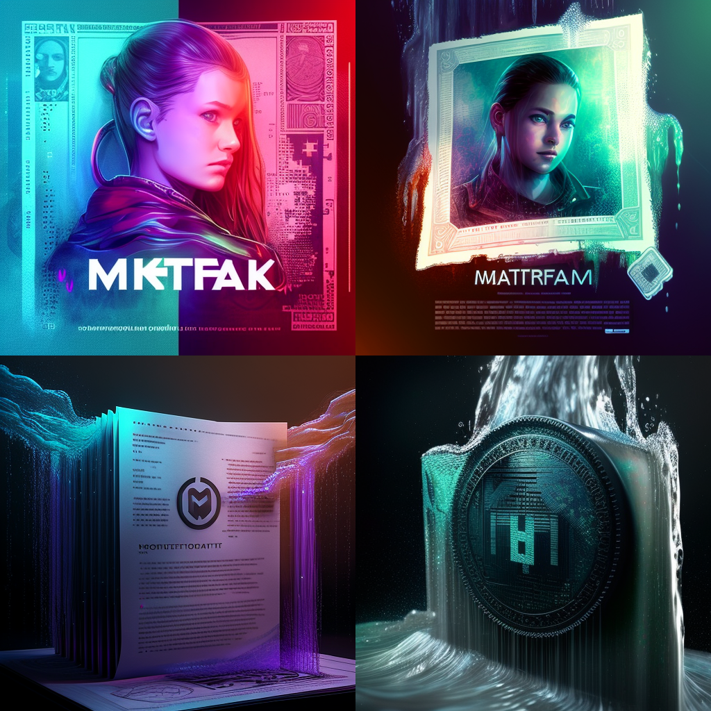

# Watermark NFT

A NFT ownership certification process and norm using steganography for digital watermarking.

## Versions

| Version | Title                  | Description                                                                    | Date       |
| ------- | ---------------------- | ------------------------------------------------------------------------------ | ---------- |
| 0.0.1   | Watermarking NFT files | Describes the technology and its advantages compared to the current solutions. | 2021-12-05 |
| 1.0.0   | Ownership-Chain        | Introduction of the Ownership-Chain and revises terms’ names.                  | 2022-02-28 |
| 1.0.1   | Graphical improvement  | Added graphics in-between paragraphs for better understanding.                 | 2022-05-03 |
| 1.0.2   | Graphical improvement  | Added sequence diagrams for token minting and token transfer.                  | 2022-09-25 |
| 1.0.3   | Graphical improvement  | Switched from Microsoft Word to Markdown markup language.                      | 2022-09-28 |
| 1.0.4   | Graphical improvement  | Switched from Markdown markup language to Google Docs.                         | 2023-03-17 |
| 1.0.5   | Graphical improvement  | Switched from Google Docs MdBook                                               | 2023-07-15 |

## Authors & Acknowledgement

Clément Stauner & Benjamin Becerra

Co-editor: Christophe Ozcan
