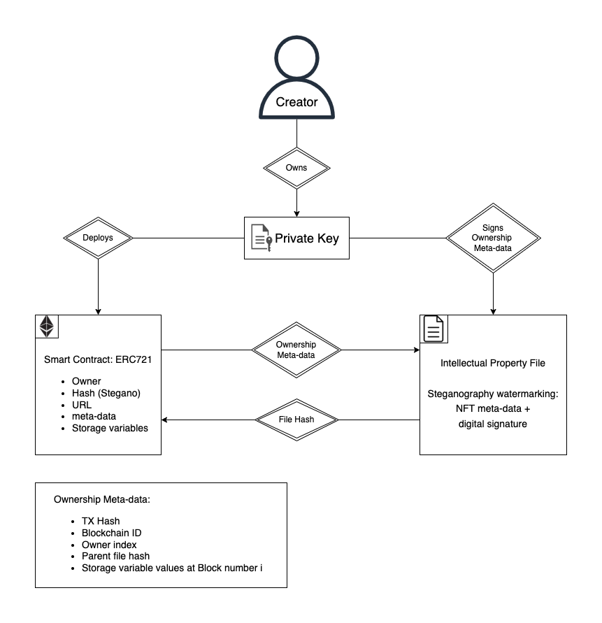

# High Level Overview

## Relationships Diagram

## Relationships Diagram Explanation

Our solution incorporates two concepts. The first one, the file needs to have the handwriting/brushstroke embedded in the data, just like the real Mona Lisa has the Leonardo da Vinci brushstroke inside its painting. Second, the link between the smart contract and the file is reinforced using existing cryptography and is made bidirectional.

The idea is to have the proof of creation of some file by a creator without having to verify with the concerned individuals (real creator or fraudster). There needs to be a signed statement “I, creator name XXX certify that I created this content ABCDEF.” embedded in the file. Only the true creator could have signed this statement and no one else. We already have technology enabling us to do just that in the Blockchain ecosystem. It is the public key encryption technology that permits signing messages to certify the authenticity.

To embed the data, we could put it in the file meta-data, but it would not be secured. There is a technique called steganography to hide data in the file’s content. Steganography is the practice of concealing a message within another message or a physical object. In computing/electronic contexts, a computer file, message, image, or video is concealed within another file, message, image, or video. Media files are ideal for steganographic transmission because of their large size.

For example, a sender might start with an innocuous image file and adjust the color of every hundredth pixel to correspond to a letter in the alphabet. The change is so subtle that someone who is not specifically looking for it is unlikely to notice the
change.

The larger the cover message (in binary data, the number of bits) relative to the hidden message, the easier it is to hide the hidden message (as an analogy, the larger the "haystack", the easier it is to hide a "needle"). So digital pictures, which contain much data, are sometimes used to hide messages on the Internet and on other digital communication media.

In our case, it is not to “hide” to message sickly speaking but to embed a watermark
certifying the file’s ownership.

Steganography and watermarks look similar, but they are not. In steganography, hidden messages should be left untouched until they reach their destination. Steganography can also be used for watermarks whose message (just an identifier) is hidden in the image, so that its source can be tracked or verified, and the image can also be identified. In such cases, the technique of hiding the message (here, the watermark) must be robust to prevent tampering.

However, watermarks may require vulnerable watermarks that can be easily modified to ensure that the image has been tampered with. This is the main difference between steganography and watermarking.

In our case, this could translate to the following process: The artist creates his file and a smart contract to certify the ownership. The meta-data signed by the owner is called the ownership meta-data (different for every new owner of the token). It contains: the owner’s public key, the owner counter/index, the blockchain network ID, the hash of the blockchain transaction and the “parent file hash” (here the genesis hash).

The signature must be done after the smart contract deployment on the Blockchain. So that the transaction hash of the contract creation can be included in the meta-data. This results with a link from the file to the smart contract (first half of the bi-directional link between the NFT smart contract and the file).

Optionally, other storage variable values at block number index X (at the time of the ownership certification) can be included if judged necessary. The value of these storage variables must be at the block number of the transaction hash specified above. The other values included in the meta-data must be on the smart contract or elsewhere on the blockchain (e.g., other smart contract, oracles, etc.) to certify their authenticities. Because if they are not, there is no way to trace the provenance of their values during an audit.

For instance, if the token represents social media post (YouTube video, tweet, Instagram image, etc.) containing public meta-data evolving overtime (like, share, comments count, view count, etc.) and those meta-data are included in the smart contract or elsewhere on the blockchain), if the developer judges relevant to include the storage variable values at the time of the ownership certification, it can be done.

The token owner signs ownership meta-data with his private key from the Blockchain
ecosystem, he embeds the signed meta-data in the file using steganography. The resulting steganographied file (original file + signed statement data) will be the file used as an NFT, not the original file. The original file is used to generate every new stegano file, for every new owner of the token.

The resulting NFT is one that has a signed message embedded in the content using the private key of the file’s creator and a unique hash in the smart contract. This NFT can be now stored in a safe place like IPFS or another place if needed.

The last step of the process will be to compute a second hash. This time the hash of the steganographied file and store it in the NFT smart contract. Bear in mind that the second hash is different from the parent hash because the input file is different. The hash needs to be stored in the smart contract as a storage variable to secure the link between the file and the smart contract. This results with a second link but this time from the file to the smart contract (second half of the bi-directional link between the NFT smart contract and the file).

Concerning the bi-directional link between the NFT smart contract and the file. First, there is the ownership certification transaction hash embedded in the file using steganography, thus resulting with a unidirectional link from the smart contract to the file. Second, there is the stegano hash stored on the smart contract, thus resulting in another unidirectional link but this time from the file to the smart contract. The outcome of the process is a pseudo bi-directional link between the NFT and the file that strengthens the relationship between the two.
