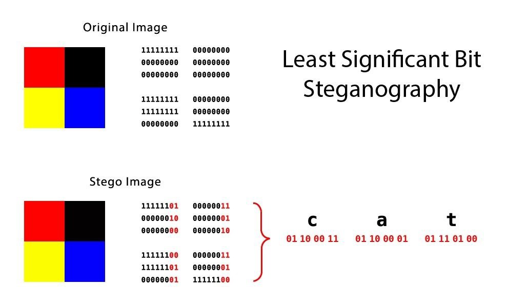

# Steganography

## Introduction

Steganography is a method used in information security to hide data within other non-secret text or data. Unlike cryptography, which focuses on making the content unreadable by encrypting it, steganography aims to keep the existence of the data secret. It is often used in digital media, where data can be embedded into images, audio files, videos, text files, etc. without causing noticeable changes to the original file.

The primary objective is to communicate securely in such a way that the very existence of the message is unknown to potential attackers.

## Steganography for images

Image watermarking is a popular application of steganography, serving as a technique to prevent unauthorized copying or establishing the authenticity of an image. It involves embedding information into an image, which can then be extracted or detected later to confirm the image's ownership or to verify its integrity. This information is usually in the form of a logo, text, or a specific pattern.

In steganographic image watermarking, the 'secret' data (watermark) is embedded into the digital image in such a way that it remains invisible to viewers but can be extracted using the correct algorithm. This process generally involves altering some of the image's pixels in a way that is indiscernible to the human eye.

There exist several steganography algorithms.

The two main types of image steganography are:

1. **Spatial Domain Watermarking:**
2. **Frequency Domain Watermarking:**

### Spatial Domain Watermarking

It is the most common and the simplest form of watermarking. It involves directly changing the values of some selected pixels in the image to embed the watermark, often using LSB algorithm (Least Significant Bit. This method is quick and easy but it is less robust, meaning the watermark can be easily lost due to image alterations like cropping, compression, or filtering.

In computing, the least significant bit (LSB) is the bit position in a binary integer representing the binary 1st place of the integer.

Similarly, the most significant bit (MSB) represents the highest-order place of the binary integer.

The LSB is sometimes referred to as the low-order bit or right-most bit, due to the convention in positional notation of writing less significant digits further to the right.

The Data may be concealed by manipulating and storing information in the least significant bits of an image or a sound file. The user may later recover this information by extracting the least significant bits of the manipulated pixels to recover the original message. This allows the storage or transfer of digital information to remain concealed.

### Frequency Domain Watermarking

This method involves transforming the image into the frequency domain using algorithms like Discrete Cosine Transform (DCT), Discrete Fourier Transform (DFT), or Discrete Wavelet Transform (DWT). The watermark is then embedded in the transformed coefficients. Frequency domain watermarking is generally more robust against common image processing operations and attacks.

Regardless of the technique used, the primary goal is to make the watermark imperceptible to human vision, to maintain the quality of the original image, and to make the watermark robust against removal attempts. Factors such as the size, complexity, and placement of the watermark, along with the image's content and quality, all impact the effectiveness of the watermarking process.

## Steganography algorithm

Another steganography algorithm is the F5 steganography algorithm which uses the concept of DCT (Discrete Cosine Transform). The Discrete Cosine Transform (DCT) is a finite sequence of data points in the form of a sum of cosine functions that oscillate at different frequencies.

DCT is a widely used conversion method in signal processing and data compression. This is for most digital media including digital images.

| Format/Standard                 | Technology Type           | Use of DCT                                                        |
| ------------------------------- | ------------------------- | ----------------------------------------------------------------- |
| 📸 JPEG                         | Digital Images            | Image compression, discards small high-frequency components       |
| 🖼️ HEIF                         | Digital Images            | Image compression, discards small high-frequency components       |
| 🎬 MPEG                         | Digital Video             | Video compression and encoding                                    |
| 🎥 H.26x                        | Digital Video             | Video compression and encoding                                    |
| 🎧 Dolby Digital                | Digital Audio             | Audio coding for data compression                                 |
| 🎵 MP3                          | Digital Audio             | Audio compression                                                 |
| 🎶 AAC                          | Digital Audio             | Audio compression                                                 |
| 📺 SDTV                         | Digital TV                | Digital television broadcast                                      |
| 🖥️ HDTV                         | Digital TV                | High-definition digital television broadcast                      |
| 🍿 VOD                          | Digital TV                | Video on demand services                                          |
| 📻 AAC+                         | Digital Radio             | Advanced audio coding for digital radio                           |
| 🎙️ DAB+                         | Digital Radio             | Digital audio broadcasting                                        |
| 📞 AACLD                        | Voice Coding              | Low delay audio coding for voice                                  |
| 🎤 Siren                        | Voice Coding              | High-quality audio coding for voice                               |
| 🗣️ Opus                         | Voice Coding              | High-quality audio coding for voice                               |
| 📈 Spectral Method              | Signal Processing         | Digital signal processing                                         |
| ☎️ Telecommunications Equipment | Telecommunications        | Used in data compression and reduction of network bandwidth usage |
| 🔢 Numerical Solution           | Computational Mathematics | Partial differential equations solving                            |

### Steganography in Watermark NFT context

The steganography algorithm should be an algorithm that hides the data well and is not detected easily by the human eye, just like a good watermark does. It is not because we want to “hide” the data strictly speaking but because we do not want to deteriorate the visual artistic creation. By “hiding” the steganography meta-data correctly we will keep the same image quality as the original one.
