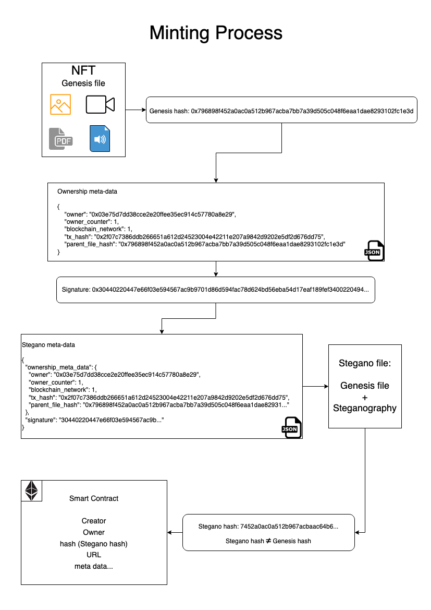
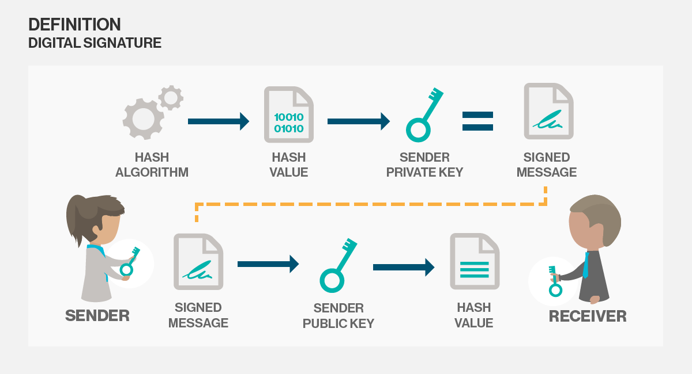

# Token Mint

## Mint Diagram



## File and meta-data

### Genesis Hash

The file (image, audio, video, PDF) is generated by the creator. The file’s hash must be computed 🛠.

The hash of the genesis file is compulsory representing the original digest of the file called the genesis hash.

```sh
0x796898f452a0ac0a512b967acba7bb7a39d505c048f6eaa1dae8293102fc1e3d
```

For the hash function, we recommend using at least the SHA2 family algorithm, but you can customize with any other hash algorithms (SHA-256, KECCAK-256, etc.).

### Ownership Meta-Data

The ownership meta-data contains:

- the owner’s public key
- the owner counter/index
- the blockchain network ID
- the hash of the blockchain transaction
- the parent file hash
- optionally storage variable values (not included in the schema)

Note: The values of the storage variables put in the ownership meta-data must be found in the smart contract storage variables at the block of the transaction hash specified.

The resulting ownership meta-data is in JSON format.

**Ownership meta-data:**

```json
{
  "owner": "0x03e75d7dd38cce2e20ffee35ec914c57780a8e29",
  "owner_counter": 1,
  "blockchain_network": 1,
  "tx_hash": "0x2f07c7386ddb266651a612d24523004e42211e207a9842d9202e5df2d676dd75",
  "parent_file_hash": "0x796898f452a0ac0a512b967acba7bb7a39d505c048f6eaa1dae8293102fc1e3d"
}
```

The genesis meta-data is signed by the file creator using his signature scheme through his own wallet (the public key which he will use to mint the NFT). The NFT creator signs the message with his private key 🔑 to create a short digital signature on the message.



The ownership meta-data are digitally signed with the private key corresponding to the public key of the token owner.

**Ownership meta-data signed signature:**

```json
30440220447e66f03e594567ac9b9701d86d594fac78d624bd56eba54d17eaf189fef3400220030e49499ffad08969bda243792369c1e82b7076d52b9154ee219fa356810df8
```

Anyone with the proper public key of the NFT creator can verify this message with the alleged digital signature. If the signature matches the message, the origin of the message is verified (it must have been created by the owner of the corresponding private key).

```json
{
  "owner": "0x03e75d7dd38cce2e20ffee35ec914c57780a8e29"
}
```

Like the actual blockchain ecosystem, a user certifies that he has done a transaction using his private key: **“I, Alice, certify I will send 1 bitcoin to Bob, at this timestamp”**.

No one can emulate this signature, and everyone can verify it by using the signatory public key. So, this will translate to: **“I, Alice, certify that I have created a file with this hash and other meta-data”**. This system creates non-repudiation to ensure that one party cannot successfully dispute its authorship of a document or a message.

### Stegano Meta-data

The resulting signature will be included in a new JSON with the new meta-data. This JSON is called the steganography meta-data (or simply stegano meta-data) because it is the message that will be embedded in the genesis file using the steganography algorithm creating the steganographied file (stegano file). This JSON is composed of at least two fields: the genesis meta-data and its signature.

**The Stegano meta-data:**

```json
{
  "ownership_meta_data": {
    "owner": "0x03e75d7dd38cce2e20ffee35ec914c57780a8e29",
    "owner_counter": 1,
    "blockchain_network": 1,
    "tx_hash": "0x2f07c7386ddb266651a612d24523004e42211e207a9842d9202e5df2d676dd75",
    "parent_file_hash": "0x796898f452a0ac0a512b967acba7bb7a39d505c048f6eaa1dae82931..."
  },
  "signature": "30440220447e66f03e594567ac9b9701d86d594fac78d624bd56eba54d17eaf189fef3400220030e49499ffad08969bda243792369c1e82b7076d52b9154ee219fa356810df8"
}
```

This steganography meta-data is embedded in the genesis file using a steganography algorithm (could be any algorithm but needs to be specified in the smart contract for future decode/audit).

There is no need to use a passphrase to encode the stegano meta-data inside the file because we do not want to hide it in the literal sense. Everyone knows there is a JSON embedded inside the file data. There is no need to over engineer the process.

If some external actor wants to audit the NFT, he will use the same steganography algorithm as the creator. He will retrieve the steganography meta-data (JSON) from the stegano file. Note that, the genesis file cannot be retrieved by applying the steganography algorithm on the stegano file, the steganography is a one-way operation.

The resulting steganographied file (which we will call stegano file) is the final product that will be stored on IPFS and used as the target file for the NFT smart contract.

### After the steganography

There are some more steps before creating the NFT smart contract.

The stegano file will be hashed by the same hash algorithm used to hash the genesis file. It is better to use the same hash algorithm for the genesis file and the stegano file to not over complicate the process. The resulting hash is called the stegano hash.

⚠️ **Stegano hash ≠ Genesis hash**

Note that the genesis hash is a completely different value compared to the stegano hash because the input files used in the hash function are not the same.

```sh
880e544e3a96b997d91eef3a2a8b9bd6d3cdd1c8de6e21a957e0110c2a7cee22
```

### Stegano File Storage

The stegano file can be stored on:

- a decentralized place like IPFS
- a centralized Cloud Storage Solution like S3 bucket
- a self-hosted in a on-premise data center

Storage is a governance file choice, but we recommend using a decentralized storage to maintain the integrity of the file on a permanent storage.

### Smart Contract Input

The stegano hash is then stored on the NFT smart contract as a storage variable. A variable that is referenced at the minting process as a parameter (like web link of the file) and is not supposed to be updatable.

The NFT smart contract should be compatible with existing marketplaces standard:

- ERC-721
- ERC-777
- ERC-1155

Along with the stegano hash, the URL of the stegano file must be included in the Smart Contract to retrieve the file.

Optionally, the smart contract can include other data such as the genesis hash, genesis meta-data, stegano meta-data, but it is not required. In fact, it is not advised to include it because it can raise the gas cost on the smart contract.

Note that for this process to work as intended to be, only the file owner can be the minter. As we have sometimes seen in the NFT ecosystem, some people mint NFTs on behalf of content creators without their authorization and their work. This minting process is not compatible with our concept because the NFT creator needs to sign the genesis meta-data with his private key, and this is an action that cannot be done “on behalf of someone”.

Moreover, the minter needs to be the signatory of the genesis meta-data because the smart contract when deployed is registered in the ledger and has been deployed by an entity identifiable by his public key. The same public key used to verify the stegano meta-data containing the message signature.
